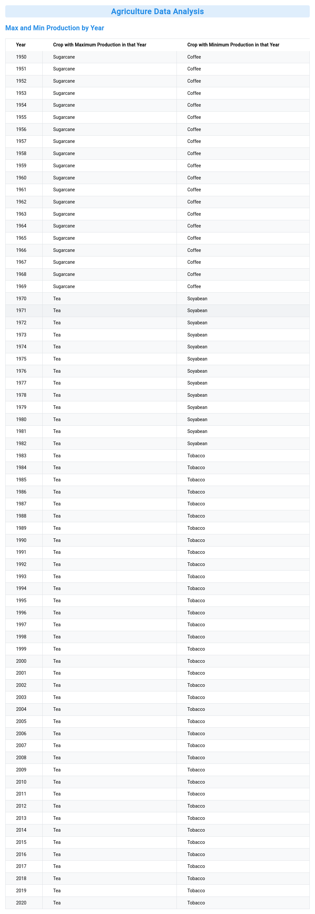
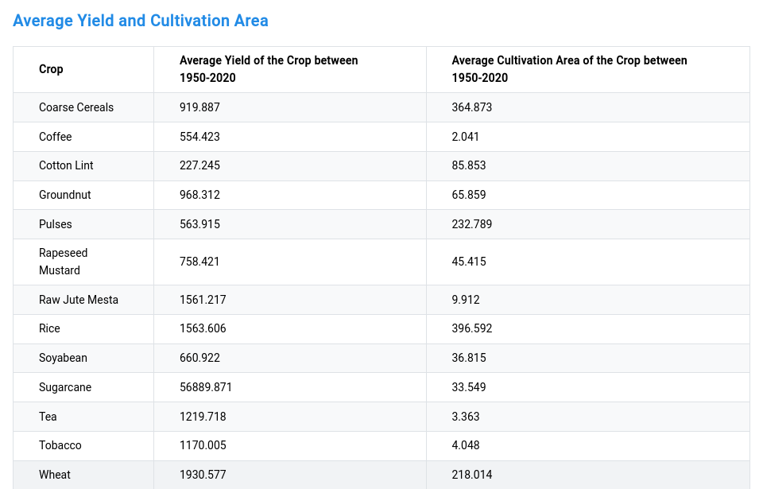

# Agriculture Data Analysis

[](https://app.netlify.com/sites/manufac-frontend-assignment/deploys)

This project analyzes Indian agriculture data from 1950 to 2020 and displays two tables:

1. Crop with maximum and minimum production each year.
2. Average yield and cultivation area of each crop over the period.

## Project Structurey

```

my-project/
├── node*modules/
├── public/
├── src/
│ ├── components/
│ │ ├── AverageTable.tsx
│ │ ├── MaxMinTable.tsx
│ ├── data/
│ │ ├── Manufac * India Agro Dataset.json
│ ├── hooks/
│ │ ├── useWindowWidth.ts
│ ├── utils/
│ │ ├── dataLoader.ts
│ │ ├── aggregations.ts
│ │ ├── aggregateAverageYieldAndArea.ts
│ ├── App.tsx
│ ├── main.tsx
│ ├── theme.ts
├── index.html
├── package.json
├── tsconfig.json
├── vite.config.ts
└── README.md

```

## How to Build and Run

### Prerequisites

- Node.js (v14 or higher)
- npm or yarn

### Installation

1. Clone the repository:

   ```sh
   git clone https://github.com/yourusername/agriculture-data-analysis.git
   cd agriculture-data-analysis
   ```

2. Install dependencies:
   ```sh
   npm install
   # or
   yarn
   ```

### Running the Development Server

3. Run the development server:

   ```sh
   npm run dev
   # or
   yarn dev
   ```

4. Open the browser and navigate to [`http://localhost:5173`](http://localhost:5173) to see the application.

### Building the Project

5. To build the project, run:

   ```sh
    npm run build
    # or
    yarn build
   ```

> The build files will be generated in the `dist` directory.

### Running the Production Server

6. To run the production server, run:

   ```sh
   npm run preview
   # or
   yarn preview
   ```

7. Open the browser and navigate to [`http://localhost:4174`](http://localhost:4174) to see the application.

## Project Details

### Data Loading and Aggregation

The data is loaded from a JSON file located in the `src/data` directory. It is parsed and any missing values are treated as 0. The following aggregations are performed:

- **Maximum and Minimum Production per Year**: Displays the crop with the highest and lowest production for each year.
- **Average Yield and Cultivation Area**: Displays the average yield and cultivation area for each crop between 1950-2020.

### Components

- **MaxMinTable**: Displays the maximum and minimum production data.
- **AverageTable**: Displays the average yield and cultivation area data.

### Custom Hook

- **useWindowWidth**: Custom hook to handle window resize events and provide the current window width.

## Screenshots

### Max and Min Production by Year



### Average Yield and Cultivation Area



## Folder Structure

The project follows a typical React project structure with separate folders for components, hooks, utils, and data.

## Theme and Styling

The project uses Mantine for styling and theming. The theme is defined in the `src/theme.ts` file.

## License

This project is licensed under the MIT License.

## Acknowledgements

- [Mantine](https://mantine.dev/) for providing a great UI library.
- [Vite](https://vitejs.dev/) for the build tool.
- [Cuvette](https://cuvette.tech/) for the assignment details.

---

Feel free to contact me at design.devanshu@gmail.com if you have any questions or need further assistance.
